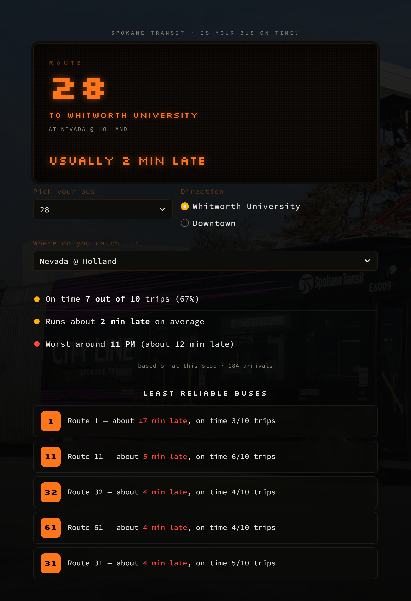

# STA Bus Reliability Tracker

A personal project that tracks how on-time Spokane Transit Authority (STA) buses
really are. It compares each bus's **scheduled** arrival time against its **actual
predicted** arrival time from STA's live feed, logs that difference for weeks, and
turns it into plain answers like *"Route 1 is usually 17 minutes late"* or
*"Route 28 to Whitworth is worse than Route 28 to Downtown."*

The goal was to build something with a **real, local dataset** (STA's own feed) and
end with actual **insights**, not just a chart dump.



---

## What it does

1. Downloads STA's official bus **schedule** (GTFS static).
2. Every 60 seconds, fetches STA's **live feed** (GTFS-Realtime) and saves where every
   bus is predicted to arrive.
3. After collecting for a while, it compares predicted vs. scheduled times to measure
   **delay**, and shows the results on a dashboard styled like a real STA bus sign.

---

## How the data is collected

There are two data sources, both from STA:

- **Static schedule (GTFS):** a zip file with the routes, trips, stops, and the exact
  scheduled time a bus is *supposed* to reach each stop. This changes rarely.
- **Live feed (GTFS-Realtime):** a `.pb` file STA updates about every minute with each
  active trip's predicted arrival time at its upcoming stops.

A small Python script (`src/poller.py`) runs in a loop:

```
every 60 seconds:
    download the live feed
    for each bus trip, for each upcoming stop:
        save (trip, route, stop, predicted arrival time, when we saw it)
    write it all to a local SQLite database
```

It just records the raw predictions. Working out the actual delay happens later, during
analysis — that keeps the collector simple so it never crashes and stops collecting.

---

## The tricky part (and how I solved it)

At first the data looked *too good* — about 90% "on time." That turned out to be a trap.

The live feed only makes a **real** prediction for stops coming up soon. For stops far
in the future, it just repeats the scheduled time (predicted = scheduled → 0 minutes
late). Since the poller logs *every* upcoming stop every minute, most rows were these
"schedule echoes" with a fake 0-minute delay, which dragged the average toward on-time.

**The fix:** for each stop visit, only keep the **last prediction made right before the
bus actually got there** — that's the most accurate one. Throwing out the echoes changed
the real system-wide on-time rate from a misleading 90% to an honest **59%**. All the
numbers in the dashboard use this method.

---

## What I found (first ~6 days of data)

- System-wide, buses are on time (within ±2 min) about **59%** of the time.
- **Route 1 is the clear worst** — on time only ~31% of the time and about **17 minutes
  late** on average, worst around midday.
- Direction matters: Route 28 **to Whitworth** runs later than the same route **to
  Downtown**.
- Delay tends to **build up along a route** — a bus that leaves a couple minutes late
  usually stays late or gets later.

(These are early numbers. The more days it collects, the more trustworthy the fine
details like per-stop and per-hour become.)

---

## How to run it yourself

You need Python 3.11+.

```bash
pip install -r sta-delay-tracker/requirements.txt
cd sta-delay-tracker

# 1. get the schedule
python src/fetch_static_gtfs.py
python src/load_static_gtfs.py

# 2. start collecting live data (leave this running for days/weeks)
python src/poller.py

# 3. once you have data, crunch it
python src/build_summary.py

# 4. open the dashboard
streamlit run dashboard.py
```

The dashboard needs collected data to show anything, so let the poller run for a while
first. The database itself is **not** in this repo (it grows to gigabytes) — the
`.gitignore` keeps `data/` and `logs/` out.

---

## Project structure

```
sta-delay-tracker/
├── dashboard.py            # the Streamlit dashboard (the STA bus-sign UI)
├── requirements.txt
├── src/
│   ├── fetch_static_gtfs.py  # download the schedule zip
│   ├── load_static_gtfs.py   # load schedule into SQLite
│   ├── poller.py             # collect the live feed every 60s  ← the important one
│   ├── delay_calc.py         # match predicted vs scheduled to get delay
│   ├── data_quality.py       # sanity-check the collected data
│   ├── insights.py           # write out the findings
│   ├── build_summary.py      # precompute fast summary tables for the dashboard
│   ├── health_check.py       # watch that the poller is still alive
│   └── keep_awake.py         # stop the laptop from sleeping mid-collection
├── docs/feed_notes.md        # notes on the live feed
├── analysis/                 # generated findings + data-quality report
└── assets/                   # dashboard background image + credits
```

---

## Tech used

Python · SQLite · pandas · Streamlit · `gtfs-realtime-bindings` (to read the live feed)

Everything is intentionally simple — SQLite instead of a big database, a plain loop
instead of heavy infrastructure — because it's a solo project running on one laptop.

---

## Limitations (being honest)

- Only about 6 usable days of data so far, and the laptop slept for part of that, so
  there are gaps (evenings are thinner than mornings).
- Finer slices (one stop, one hour) have less data behind them, so they're noisier.
- Delay is based on the feed's *predictions* near arrival, not a physical measurement of
  when the bus hit the stop.

---

## Credits

- Bus data: [Spokane Transit Authority](https://www.spokanetransit.com/) GTFS feeds.
- Dashboard background photo: *Spokane City Line bus* by JTRamsey,
  [Wikimedia Commons](https://commons.wikimedia.org/wiki/File:Full_Spokane_City_Line_bus_charging_at_SCC_transit_center_October_2023.jpg),
  CC BY-SA 4.0.
